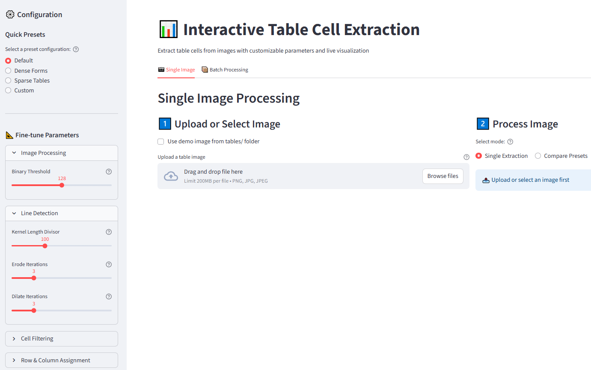

# Table Cell Extraction Solution

A robust, configurable solution for extracting table cells from scanned document images using OpenCV. For a better understanding of the system architecture, machine learning methodology, implementation details, refer to **report.pdf**.




This guide explains how to run the scripts and application.

## Quick Start

### Installation

1. **Open Terminal and navigate to the project directory:**
   ```powershell
   cd C:\my_project  (example)
   ```
2. **Create and activate a virtual environment:**
   python -m venv .venv
    # windows
   .venv\Scripts\activate
    # Linux, MacOS:
    source .venv/bin/activate

3. **Install dependencies:**
   pip install -r requirements.txt


### Run
Extract cells from all tables in a directory with default settings:

```powershel
python extract_cells.py
```

This will:
1. Process all `.png` and `.jpg` files in the `tables/` directory
2. Extract individual cells from each table
3. Save cells as `cell-{row}-{col}.png` in subdirectories of `results/`

### Example Output Structure

```
results/
├── 0/
│   ├── cell-0-0.png
│   ├── cell-0-1.png
│   ├── cell-1-0.png
│   └── ...
├── 1/
│   ├── cell-0-0.png
│   └── ...
└── ...
```

### Validate Results

Analyze the quality of extraction:

```powershel
python validate_extraction.py results
```

This shows:
- Number of cells extracted per table
- Grid dimensions (rows × columns)
- Coverage percentage
- Quality status (EXCELLENT/GOOD/FAIR/POOR)
- Tables that may need parameter tuning

##################################################################################################
The following guideline is optional and is intended for those who wish to study the code in depth.

## Advanced Usage

### Custom Configuration

For tables with different characteristics, create a custom configuration:

```python
from extract_cells import TableConfig, main

# Configuration for densely-packed tables
config = TableConfig(
    row_grouping_tolerance=0.3,      # Stricter row grouping
    column_center_tolerance=3,        # More precise column alignment
    kernel_length_divisor=80,         # Shorter line detection kernel
    min_cell_width=15,               # Larger minimum cell size
    min_cell_height=15
)

main("tables", "results", config)
```

### Configuration Parameters

#### Image Preprocessing
- `binary_threshold` (int, default=128): Threshold for binary conversion

#### Line Detection
- `kernel_length_divisor` (int, default=100): Image width ÷ this = kernel length
- `vertical_kernel_width` (int, default=1): Width of vertical line kernel
- `horizontal_kernel_height` (int, default=1): Height of horizontal line kernel
- `erode_iterations` (int, default=3): Erosion iterations for line detection
- `dilate_iterations` (int, default=3): Dilation iterations for line detection
- `final_erode_iterations` (int, default=2): Final erosion after combining lines

#### Line Combination
- `vertical_line_weight` (float, default=0.5): Weight for vertical lines (0-1)
- `horizontal_line_weight` (float, default=0.5): Weight for horizontal lines (0-1)

#### Cell Filtering
- `min_cell_width` (int, default=10): Minimum cell width in pixels
- `max_cell_width` (int, default=1000): Maximum cell width in pixels
- `min_cell_height` (int, default=10): Minimum cell height in pixels
- `max_cell_height` (int, default=500): Maximum cell height in pixels
- `filter_by_area_ratio` (bool, default=True): Enable area ratio filtering
- `min_area_ratio` (float, default=0.0001): Minimum cell area / image area
- `max_area_ratio` (float, default=0.5): Maximum cell area / image area

#### Row/Column Assignment
- `row_grouping_tolerance` (float, default=0.5): Multiplier of mean height for row grouping
- `column_center_tolerance` (int, default=4): Divisor for column center distance


## Tuning Guide

### For Dense Tables (small cells, thin lines)
```python
config = TableConfig(
    kernel_length_divisor=80,        # Shorter kernel for finer lines
    row_grouping_tolerance=0.3,      # Stricter row grouping
    column_center_tolerance=3,       # More precise alignment
    min_cell_width=15,              # Higher minimum size
    min_cell_height=15
)
```

### For Sparse Tables (large cells, thick lines)
```python
config = TableConfig(
    kernel_length_divisor=120,       # Longer kernel for thicker lines
    row_grouping_tolerance=0.7,      # More lenient row grouping
    column_center_tolerance=6,       # More flexible alignment
    min_cell_width=20,              # Filter tiny artifacts
    max_cell_width=1500             # Allow larger cells
)
```

### For Tables with Merged Cells
The algorithm handles merged cells automatically:
- Merged cells are assigned to the column of their leftmost edge
- Vertical spanning cells appear in multiple rows
- Horizontal spanning cells may have gaps in the column sequence

### Troubleshooting

**Problem: Missing cells**
- Increase `row_grouping_tolerance` and `column_center_tolerance`
- Decrease `min_cell_width` and `min_cell_height`
- Adjust `kernel_length_divisor` (try 80 or 120)

**Problem: Too many false positives**
- Increase `min_cell_width` and `min_cell_height`
- Enable `filter_by_area_ratio` and adjust ratios
- Increase `min_area_ratio` to filter small artifacts

**Problem: Incorrect row/column assignment**
- Adjust `row_grouping_tolerance` (smaller = stricter grouping)
- Adjust `column_center_tolerance` (smaller = closer to left edge)

**Problem: Lines not detected properly**
- Adjust `kernel_length_divisor` (smaller = shorter kernel for fine lines)
- Adjust `erode_iterations` and `dilate_iterations`
- Check if image needs preprocessing (de-skewing, noise removal)

## Performance

On the provided test dataset (55 tables):
- **Average coverage**: 96.2%
- **Processing speed**: ~1.2 tables/second
- **EXCELLENT results**: 85.5% of tables (100% coverage)
- **GOOD or better**: 92.8% of tables (>80% coverage)

## Data Structure

### BoxAnnotation
```python
@dataclass
class BoxAnnotation:
    x: int              # Upper left corner x (absolute)
    y: int              # Upper left corner y (absolute)
    width: int          # Box width (absolute)
    height: int         # Box height (absolute)
    class_name: str     # Format: "cell-{row}-{col}"
```


## Command-Line Reference

### extract_cells.py
```powershel
# Show help
python extract_cells.py --help

# Use default directories (./tables -> ./results)
python extract_cells.py

# Specify directories
python extract_cells.py /path/to/tables /path/to/results
```

### validate_extraction.py
```powershel
# Show help
python validate_extraction.py --help

# Validate results with default threshold (80%)
python validate_extraction.py results

# Use custom coverage threshold
python validate_extraction.py results --threshold 90.0
```

## Integration Example

```python
from pathlib import Path
from extract_cells import TableAnalysis, TableConfig, BoxAnnotation

# Create custom configuration
config = TableConfig(
    kernel_length_divisor=100,
    row_grouping_tolerance=0.5,
    column_center_tolerance=4
)

# Initialize analyzer
analyzer = TableAnalysis(config)

# Process single image
image_path = Path("tables/my_table.png")
boxes = analyzer.process(image_path)

# Use the results
for box in boxes:
    print(f"Cell at row {box.class_name}: "
          f"x={box.x}, y={box.y}, w={box.width}, h={box.height}")

# Save cells to disk
output_dir = Path("output/my_table")
analyzer.write_results(boxes, image_path, output_dir)
```


## Credits

The python codes are based on the tutorial: "Image-based Table Detection and Cell Recognition with OpenCV"


